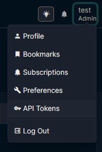

# NetBox tasks

## Installing NetBox
This repository includes a customized NetBox Docker repository (v3.3.0). Clone it using:

```bash
$ git clone ...
$ cd netbox-docker

$ docker compose pull
$ docker compose up

```

If the superuser variables doesn't set it up automatically, create a superuser to access the application:

```bash
$ docker compose exec netbox /opt/netbox/netbox/manage.py createsuperuser
```

## Adding data
Add new sites through the NetBox UI. Go to Organization/Sites and click Import. 


Upload the file [initial_data.yaml](initial_data.yaml).

## Adding custom script
In NetBox UI, go to Customization/Scripts and click Add.


Upload the file [SiteFilter.py](scripts/SiteFilter.py) located in the `custom_scripts` directory.

To run the script, just click on the name. The result will be like this:


## Running API script
This script allows you to query NetBox sites by their status using the API. It's in the root directory of the repository: [netbox_sites.py](netbox_sites.py).

It's recomended to set up a virtual environment, but in most scenarios it would be unnecesary.  

```bash
cd netbox-test
python3 -m venv .venv

source .venv/bin/activate
# probably you already have the requests library. If not:
pip install requests

# or just install requirements
pip install -r requirements.txt
```

**Options**. You can ask for help with `python3 netbox_sites.py --help`:
```
usage: netbox_sites.py [-h] [--status STATUS] [--url URL] --token TOKEN [--list-statuses]

Query sites in NetBox by specific status

options:
  -h, --help       show this help message and exit

  # The script waits for the next arguments:
  --status STATUS  Status of sites to query (active, planned, etc.)
  --url URL        NetBox base URL (default: http://localhost:8000)
  --token TOKEN    NetBox API token
  --list-statuses  Show available statuses
```

To run the script, you need the API token and the status. If you don't provide an URL, the scripts uses by default http://localhost:8000.  

You can create a new token through the user menu:



In this case, you can simply write:

```bash
python3 netbox_sites.py --token "<YOUR_API_TOKEN>" --status planned
```

and get this output: 

```
Querying sites with status 'planned' on http://localhost:8000...

Sites found with status 'planned' (2 sites):
============================================================
ID: 5
Name: Site 1
Slug: site_1
Status: Planned
Description:
URL: http://localhost:8000/api/dcim/sites/5/
----------------------------------------
ID: 6
Name: Site 2
Slug: site_2
Status: Planned
Description:
URL: http://localhost:8000/api/dcim/sites/6/
----------------------------------------
```

---

250718 - Noa Velasco