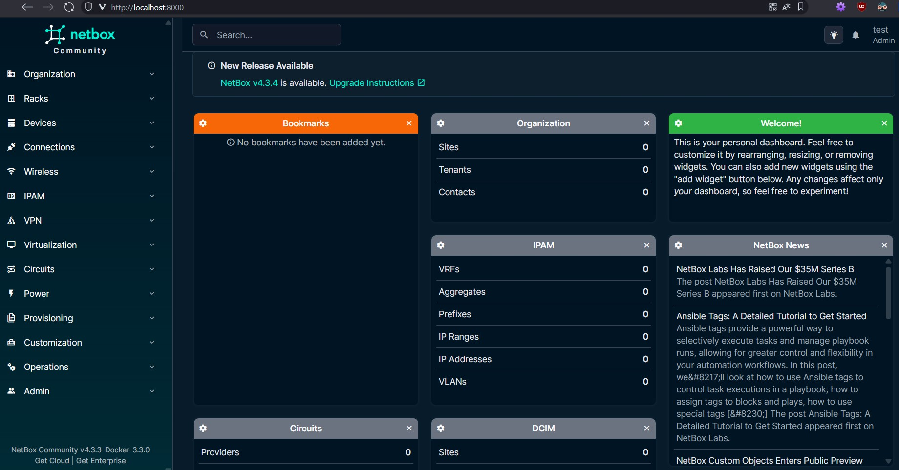
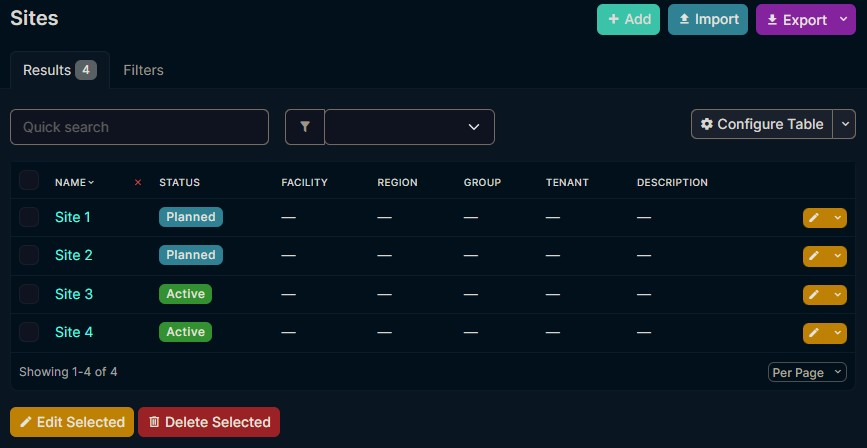

# Netbox Test 

## Step by Step

### 1. Installing NetBox
- Creation of the main directory NETBOX-TEST.  
- Cloning the netbox-docker repository (v. 3.3.0).  
- Checking the official documentation at https://github.com/netbox-community/netbox-docker/wiki/Getting-Started.  

- Among the errors shown in the console, I detected the following:

> FATAL:  database "netbox" does not exist  
> ...  
> ERROR:  relation "django_content_type" does not exist at character 106  
> ...  
> dependency failed to start: container netbox-docker-netbox-1 is unhealthy  

    Based on several tutorial videos I watched, there are recommended preliminary configurations that aren't mentioned in the basic documentation. Despite these errors, I confirmed that the application still runs properly and I could proceed with testing.  

- I access `http://localhost:8000` successfully and it redirects me to login. 
- I create a user using the command `docker compose exec netbox /opt/netbox/netbox/manage.py createsuperuser` (calls Django's functionality):  
    - Username: "test"
    - Email address: "..."
    - Password: "..."
- However, for persistence, I add it to the configuration in the `docker-compose.override.yml` file and access to verify that it works:  



## 2. Initial Data
- I verify that the quickest and simplest method to enter a few data points is through the GUI.  
- I create the file [initial_data.yaml](../initial_data.yaml) and upload it to the manager at http://localhost:8000/dcim/sites/import/.  




### 3. Custom Script for NetBox (1)
- I create a custom Python script and add it through the GUI (Optimizations/Scripts), but when uploading the file I receive a warning:  
    `Could not load scripts from module <script_name.py>`
- I check the [documentation](https://netboxlabs.com/docs/netbox/customization/custom-scripts/) and the issues in the NetBox repository. Then I verify that it's an error in my script by creating another one as simple as possible: [TestScript.py](../scripts/TestScript.py).  
- The problem at first seems to be in my code. I simplify it and add functionalities gradually.
- I need more information on how NetBox scripts are built. I consult [NetBoxLabs](https://netboxlabs.com/blog/getting-started-with-netbox-custom-scripts/) and code from repositories on Github.  
- If I try to access data, the script fails to load and cannot be executed. It seems that the Docker volume is storing several versions of the script, so I cleaned the directory manually and restarted NetBox, which resolved the duplication issue. Apparently, that was the problem; for some reason, the scripts were being duplicated instead of updated.  
- The basic script works when filtering by status. I add the logic to generate the output.


### 4. Script for NetBox (2)
- To use the NetBox API, an API Token is needed. I create one through the user menu:


- First, I check the access to the API.  
- I verify that the following works:

```
# Test basic API connection
curl -H "Authorization: Token <MY_TOKEN>" \
     -H "Content-Type: application/json" \
     http://localhost:8000/api/

# Test sites endpoint
curl -H "Authorization: Token <MY_TOKEN>" \
     -H "Content-Type: application/json" \
     http://localhost:8000/api/dcim/sites/
```
- I can also access http://localhost:8000/api/status/ logged in as a superuser. I confirm that the script will be executed externally and access the API independently from the application.  
- I create a virtual environment to install Python libraries like `requests` and `dotenv`, but in principle the first one won't be necessary because it's included, and the second one can be omitted if we enter the API token as an argument.

### 5. Final Touches
In addition to creating the [README.md](../README.md) file and these project notes throughout the test, I need to improve the documentation of the files. I make sure to leave it as correct as possible, check the latest changes, paths, etc.
